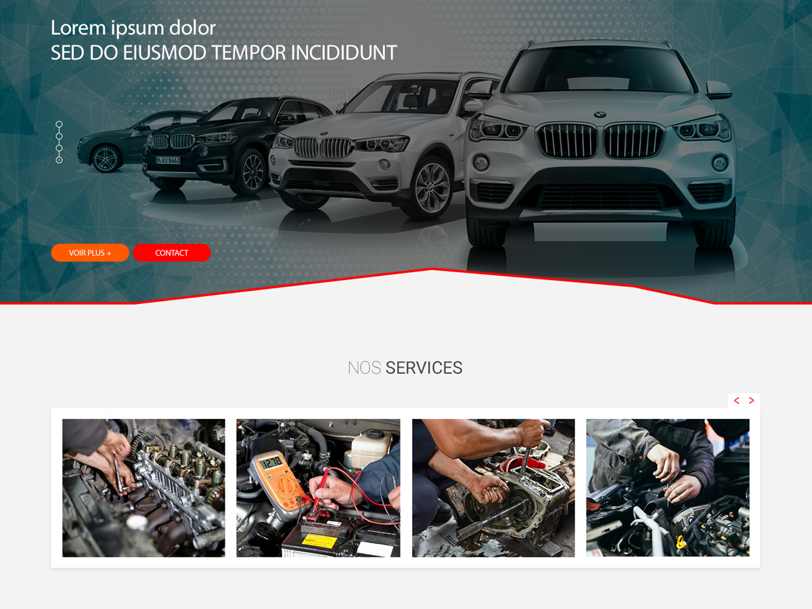

# Sociefa version Wordpress avec theme personalisée

**Theme Name** : fex

**Version** : 1.0

**Author** : Nirina RAZAKANIRINA

**Description** : Responsive thème

**Requires at least** : WordPress 5.x

# Descriptions
* Site vitrine
* Single page + Galerie photo, Modal
* Custom post type pour chaque section
* Ajustage menu admin pour chaque membre
* bootstrap 4 

# Plugins wp

* [Advanced Custom Fields](https://www.advancedcustomfields.com/) Version 5.8.1
* [Contact Form 7](https://contactform7.com/) Version 5.1.6
* [WP-SCSS](https://github.com/ConnectThink/WP-SCSS) Version 1.2.4
* [Yoast SEO](https://yoa.st/1uj) Version 12.6.2

# Autres librairie javascript

*  jquery v-3.x
*  [Slick-carousel.js](https://cdnjs.cloudflare.com/ajax/libs/slick-carousel/1.9.0/slick.min.js)
*  [Slick-carousel.css](https://cdnjs.cloudflare.com/ajax/libs/slick-carousel/1.9.0/slick.min.css)
*  [Slick-carousel-theme.css](https://cdnjs.cloudflare.com/ajax/libs/slick-carousel/1.9.0/slick-theme.min.css)
*  [hc-offcanvas-nav](https://github.com/somewebmedia/hc-offcanvas-nav)

# Preprocesor Sass/Scss 
- root `sass --watch sass/style.scss:css/style.css --style compressed`